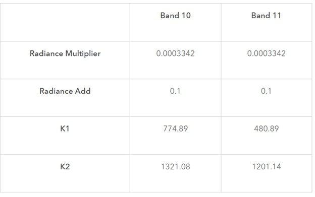

# Urban Heat Island Vulnerability Study in Wayne County, Michigan
This blog post will focus on a heat vulnerability study I conducted within Wayne County, and the methodology utilized to conduct the analysis. This analysis was conducted to determine which census tracts within the county were at risk of urban heat island (UHI) effect. The sections that I will focus on include data acquisition, data conversion, and methodology methods used to aggregate the data.
## Data Acquisition
The data used in the study were acquired from Landsat, NLCD, and the US Census Bureau. From Landsat, satellite imagery consisting of thermal bands 10 and 11 were acquired to determine the Land Surface Temperature within Wayne County. For this study, thermal imagery taken on June 17, 2021 was acquired. From the NLCD, 3 raster datasets consisting of land use cover, tree canopy cover, and impervious surface cover were acquired. From the US Census Bureau, 8 demographic datasets were acquired and will be used to construct the heat risk index later in the analysis.
## Data Conversion
The format of the pixel values from the thermal imagery rasters are not in Fahrenheit, hence they need to be converted into Fahrenheit. This is done by running 3 formulas that convert the raw pixel values into Radiance, then Kelvin, and then Fahrenheit:
•	TOAr  = (Radiance Multiplier * raster) + Radiance Add
•	Kelvin = K2 / Ln(K1/TOAr + 1)
•	Fahrenheit = 1.8 * (Kelvin – 273.15) + 32
Important metrics including the Radiance Multiplier, Radiance Add, and K constants can be determined from the below chart showing the necessary values to plug in to the 3 formulas based on which band the raster is. The site containing the chart and the applied formulas can be found here: https://www.esri.com/arcgis-blog/products/product/analytics/deriving-temperature-from-landsat-8-thermal-bands-tirs.
!
After this analysis is conducted, we have acquired the land surface temperature in Fahrenheit measure. Below are the measured findings of the average land surface temperature by census tract within Wayne County. The average land surface temperature for each census tract was calculated using Zonal Statistics as Table. This tool was also used for the NLCD rasters to calculate their averages (with the exception of land use, where majority was calculated instead).

## Heat Risk Index Analysis
In addition to determining land surface temperature, I also conducted an analysis on which tracts were at higher risk of UHI by assessing land use and demographic data. Using 8 demographic columns and the 3 raster datasets collected from NLCD, I constructed a heat risk index for my analysis.

Using ArcGIS Pro, I created new columns that contained values from 1 to 5, by splitting the tracts into 5-class quantiles for each column in the index. Values under the lowest quantile were given a value of 1, while values with the highest quantile were given a value of 5. An exception was used for white population, bachelor’s degree, median income, and TCC cover, where the lowest quantile was instead given a value of 5 and the highest given a value of 1.
The weight distribution within each category was determined subjectively. Population Density was given a higher weighting than Total Population because higher density frequently attributed to higher Land Surface Temperatures. Under susceptibility, bachelor’s degree and median income were given higher weighting since poorer communities frequently have less leverage in deciding which communities they live in and can be driven out by gentrification efforts. For hazard, tree canopy and impervious surface covers were given higher weightings due to the use of tree canopies to reduce urban temperatures and impervious surfaces like parking lots absorbing heat. 
After each column was assigned a value between 1 and 5, the values were then calculated by its respective weight and then divided by the number of variables present in the section (Exposure with 2, Susceptibility with 6, Hazard with 4). Below are the 3 maps indicating the risk of each census tract by the 3 categories.

Finally, the risk score from each category were multiplied by the final weighting of 0.333 (0.334 for hazard) and divided by 3 to determine the final heat risk index score.

